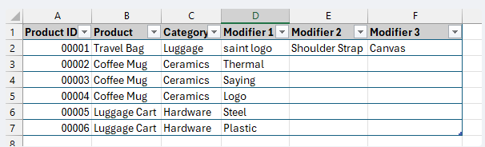

Extend to include sales orders. 
    Extend to include sales orders. 

    **Sales Order Workflow Requirements**

    - Product list and pricing integration
    - Customer selection and sales order creation
    - Product selection with customer remarks
    - Inventory verification and soft ship date confirmation
    - Future enhancements: BOM and materials tracking with automated inventory checks and notifications

    **Customer SLA Management**

    - Default 15-day SLA per customer record (overridable)
    - Risk tracking for orders with no progress after 3 days (future risk board implementation)

    **Current Process**

    - Create and submit sales order
    - Auto-generate invoice using product and price lists

    **Reference Materials**

    Product list structure: 

    Price list structure: 
    
    
    
    